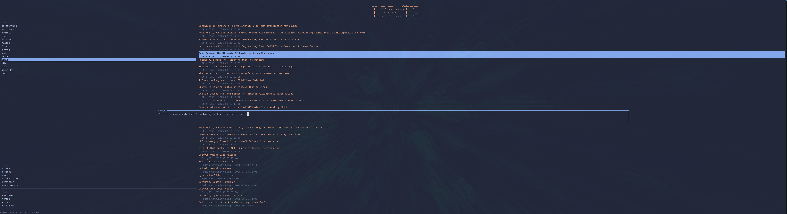

# tuxwire

A terminal-based RSS reader built for people who take notes while they read.

tuxwire aggregates feeds from any source you choose — Linux/FOSS/kernel news, or anything else you subscribe to — into a single fast TUI. Save articles, tag them by status, and jot notes without ever leaving the terminal.



## Features

- **Multi-source RSS aggregation** — pull from as many feeds as you want
- **Inline note-taking** — save an article and attach a note without switching apps
- **Color-coded article states** — read, saved, and not-interested are all visually distinct
- **SQLite-backed storage** — your saved articles and notes persist locally
- **Catppuccin Macchiato theme** — easy on the eyes
- **Cross-platform** — runs anywhere Rust runs, including on your phone via Termux

## Installation

tuxwire isn't published to crates.io yet, so for now it's build-from-source.

### Prerequisites

- [Rust and Cargo](https://www.rust-lang.org/tools/install) (stable toolchain)
- A C compiler toolchain (`build-essential` on Debian/Ubuntu, `base-devel` on Arch, Xcode Command Line Tools on macOS) — needed if the bundled SQLite has to compile from source

### Build from source

```bash
git clone https://github.com/shanecuster/tuxwire.git
cd tuxwire
cargo build --release
```

The compiled binary will be at `target/release/tuxwire`. Optionally, copy it somewhere on your `$PATH`:

```bash
cp target/release/tuxwire ~/.local/bin/
```

### Running on Android (Termux)

```bash
pkg install rust
git clone https://github.com/shanecuster/tuxwire.git
cd tuxwire
cargo build --release
```

## Usage

Launch tuxwire from your terminal:

```bash
tuxwire
```

### Keybindings

| Key     | Action                                  |
|---------|------------------------------------------|
| `s`     | Save / unsave the current article        |
| `n`     | Add or view a note on a saved article     |
| `Enter` | Confirm and save a note                   |
| `Esc`   | Discard a note in progress                |

## Configuration

> _TODO: document config file location and feed source format once finalized._

## Roadmap

- [ ] Publish to crates.io
- [ ] Config file for managing feed sources
- [ ] Public release / packaging for distros

## Contributing

This project is still under active development and personal testing. Issues and pull requests are welcome, but expect things to be in flux.

## License

Licensed under the [MIT License](LICENSE).
